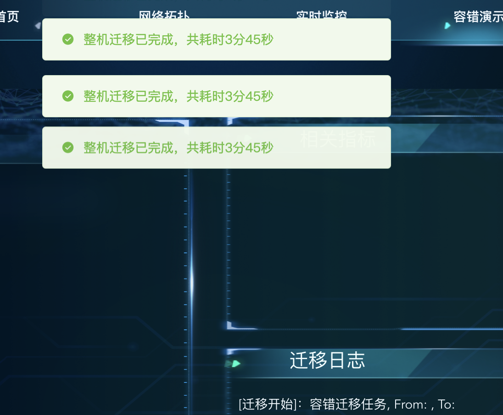

## 问题：
- 前端问题
 - 1. 首页时钟不变, 数据已经存在，没有映射到数据库 
- 后端解析报文问题
 - 1. 使用率和算力，需要使用float，需要四个字节,现在是int8,需要bytes大端
 - 2. 拓扑展示问题，rtu和交换机
 - 3. vmc下的板卡设备，展示一类，需要点击展示具体数量，要直接按板卡实际数量渲染 
 - 4. 遥测指令，性能测试，上限需要确定,确定之后,随机浮动 
 - 5. 遥测指令，整机测试 
 - 6. 遥测指令，分区假实现 
 - 7. 容错展示，展示消息重复出现 
 - 8. 实时监控，同步错误挂掉的节点   数据展示有错误